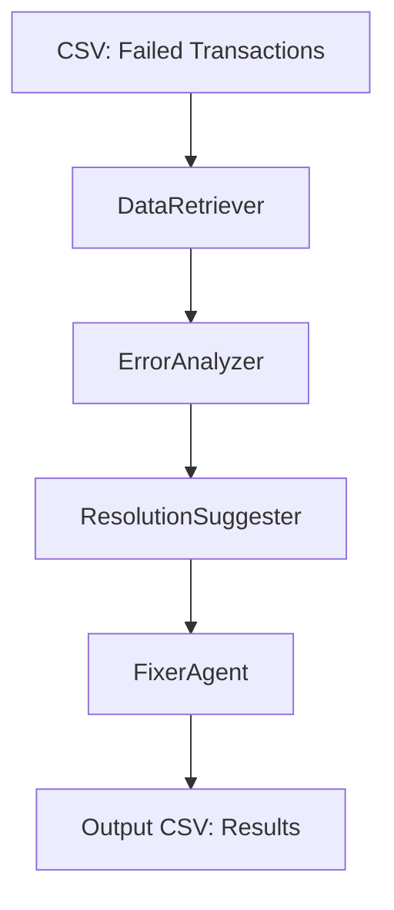

# Enrollment Processor

Automated Multi-Agent System for Insurance Enrollment Error Analysis and Resolution

---

## Overview

**Enrollment Processor** is an AI-powered, multi-agent system that automates the analysis and resolution of failed insurance member enrollment transactions. It leverages CrewAI, OpenAI, and Model Context Protocol (MCP) to simulate a real-world group insurance scenario, reading failed enrollments from a CSV, analyzing issues, suggesting and simulating fixes, and outputting results to a new CSV.

---

## How It Works: Technical Details

### 1. Model Context Protocol (MCP)
- **MCP** is a protocol for connecting AI agents to external tools and data sources in a standardized way.
- This project uses a FastMCP server (`servers/insurance_mcp_server.py`) to expose tools for agents, such as:
  - `get_transaction_details`: Retrieve transaction data by ID.
  - `analyze_error`: Analyze a transaction for errors and return a human-readable explanation.
  - `fix_transaction`: Simulate fixing a transaction (can be extended to real DB logic).
- The MCP server runs as a subprocess and is accessed by agents via the CrewAI MCP adapter.

### 2. Agents and Their Roles
- **DataRetriever**: Uses the MCP tool to fetch transaction details by `transaction_id`.
- **ErrorAnalyzer**: Uses the MCP tool to analyze the transaction and explain why it failed (e.g., missing fields, invalid data).
- **ResolutionSuggester**: Proposes a fix for the error, using MCP to suggest corrections or required data.
- **FixerAgent**: Simulates applying the fix (e.g., filling missing fields, correcting data) and returns the result. This can be connected to a real database for production use.
- All agents are defined and orchestrated in `src/crew_setup.py`.

### 3. OpenAI Integration
- The project uses OpenAI's GPT models (via the `openai` Python package) to power the CrewAI agent reasoning and language understanding.
- The OpenAI API key is required in `src/.env` (never commit this file!).
- CrewAI agents use OpenAI models to:
  - Interpret transaction data and errors.
  - Generate explanations and suggested fixes in natural language.
  - Collaborate in a chain-of-thought workflow for each transaction.

### 4. Workflow
- The main script (`src/main.py`):
  1. Loads failed transactions from `data/sample_failed_transactions.csv`.
  2. For each transaction, spins up the CrewAI agent crew with MCP tools.
  3. Each agent performs its role in sequence, passing results to the next agent.
  4. The final result (analysis and fix) is written to `output/crew_results.csv`.

---

## Features
- **Multi-Agent Workflow:** DataRetriever, ErrorAnalyzer, ResolutionSuggester, and FixerAgent collaborate to process each failed transaction.
- **Realistic Data:** Uses sample group insurance enrollment data with realistic errors and missing fields.
- **Automated Analysis & Fixes:** Each transaction is analyzed, errors are explained, and fixes are suggested and simulated.
- **Extensible:** Easily connect to real databases or enhance error handling as needed.
- **Clear Output:** Results are written to `output/crew_results.csv` for review.

---

## Visual Workflow



---

## Project Structure

```
README.md
requirements.txt
.gitignore

/data/
    sample_failed_transactions.csv
/output/
    crew_results.csv
/servers/
    insurance_mcp_server.py
/src/
    main.py
    crew_setup.py
    agents.py
```

---

## Setup & Usage

1. **Clone the repository:**
   ```powershell
   git clone https://github.com/ksvsivam1403/Enrollment-Processor.git
   cd Enrollment-Processor
   ```
2. **Install dependencies:**
   ```powershell
   pip install -r requirements.txt
   ```
3. **Set up your environment:**
   - Create a `.env` file in `src/` with your OpenAI API key:
     ```env
     OPENAI_API_KEY=your-key-here
     ```
4. **Run the main workflow:**
   ```powershell
   python src/main.py
   ```
5. **Review results:**
   - See `output/crew_results.csv` for the processed results.

---

## Customization & Extensibility
- **Connect to a real database:** Update `FixerAgent` and the MCP server logic in `servers/insurance_mcp_server.py`.
- **Enhance error handling:** Add more sophisticated checks in the MCP server or agents.
- **Expand agent logic:** Add new agents or tools for more complex workflows.

---

## For Non-Technical Users
- This tool automatically reviews failed insurance enrollments, explains what went wrong, and suggests or simulates fixes—saving time and reducing manual effort.
- Results are provided in a simple spreadsheet for easy review.

---

## For Developers
- Modular Python code using CrewAI, OpenAI, and MCP (FastMCP).
- Easily extensible for new data sources, error types, or integration with production systems.
- See `src/crew_setup.py` and `servers/insurance_mcp_server.py` for agent/task logic.

---

## Security Note
- **Never commit your `.env` file or API keys to git.**
- `.env` is included in `.gitignore` and has been scrubbed from repository history.

---

## License
MIT License (add your own license as needed)

---

## Maintainer
- [ksvsivam1403](https://github.com/ksvsivam1403)

---

## Acknowledgments
- Built with [CrewAI](https://github.com/joaomdmoura/crewAI), [OpenAI](https://openai.com/), and [Model Context Protocol (MCP)](https://github.com/modelcontext/protocol).